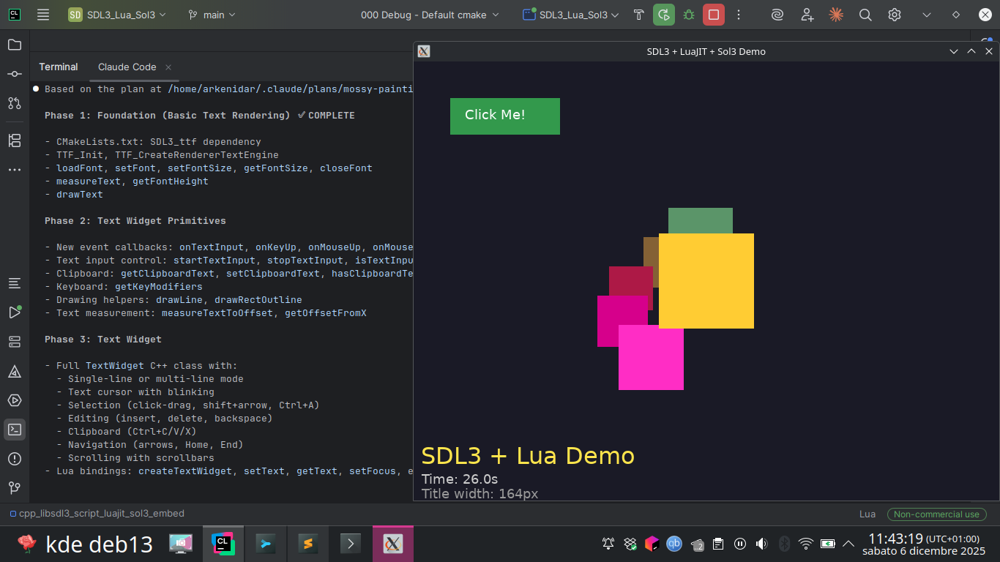

# SDL3 + LuaJIT + Sol3 Integration

A lightweight 2D game engine framework demonstrating integration of CMake, C++, SDL3, Sol3, and LuaJIT for embedded scripting.



## Features

- **SDL3**: Modern graphics, window management, and input handling
- **SDL3_ttf**: TrueType font rendering with GPU acceleration
- **LuaJIT**: High-performance Lua scripting engine
- **Sol3**: Modern C++ Lua binding library
- **CMake**: Cross-platform build system with FetchContent for Sol3
- **Lua Scripting**: Full game loop control from Lua (update, render, events)

## Prerequisites

### Ubuntu/Debian
```bash
sudo apt-get install cmake build-essential libsdl3-dev libsdl3-ttf-dev libluajit-5.1-dev pkg-config
```

### Fedora/RHEL
```bash
sudo dnf install cmake gcc-c++ SDL3-devel SDL3_ttf-devel luajit-devel pkgconfig
```

### macOS
```bash
brew install cmake sdl3 sdl3_ttf luajit pkg-config
```

### Windows
- Install [CMake](https://cmake.org/download/)
- Install [Visual Studio](https://visualstudio.microsoft.com/) with C++ support
- Install [vcpkg](https://vcpkg.io/) and install dependencies:
  ```powershell
  vcpkg install sdl3 sdl3-ttf luajit
  ```

## Building

```bash
# Create build directory
mkdir build && cd build

# Configure
cmake ..

# Build
cmake --build .

# Run
./SDL3_Lua_Sol3
```

## Project Structure

```
.
├── CMakeLists.txt          # Build configuration
├── src/
│   └── main.cpp            # Main C++ application (single-file architecture)
├── scripts/
│   └── main.lua            # Main Lua script with demo
├── assets/
│   └── DejaVuSans.ttf      # Default font for text rendering
├── docs/
│   └── screens/            # Screenshots
└── README.md               # This file
```

## Lua API Reference

### Application Control
| Function | Description |
|----------|-------------|
| `quit()` | Exit the application |
| `print(message)` | Print to console with `[Lua]` prefix |

### Window Management
| Function | Description |
|----------|-------------|
| `setWindowTitle(title)` | Set the window title |
| `getWindowSize()` | Returns table with `width` and `height` |
| `setBackgroundColor(r, g, b)` | Set clear color (0.0-1.0 range) |
| `setBackgroundColor(r, g, b, a)` | Set clear color with alpha |

### Drawing
| Function | Description |
|----------|-------------|
| `drawRect(x, y, w, h, r, g, b, a)` | Draw filled rectangle (alpha optional) |

### Font Management
| Function | Description |
|----------|-------------|
| `loadFont(path, size)` | Load TTF font, returns fontId or nil |
| `setFont(fontId)` | Switch to a loaded font |
| `setFontSize(size)` | Change current font size (caches sizes) |
| `getFontSize()` | Get current font size |
| `closeFont(fontId)` | Unload font and free memory |

### Text Rendering
| Function | Description |
|----------|-------------|
| `drawText(text, x, y, r, g, b)` | Draw text at position with color |
| `drawText(text, x, y, r, g, b, a)` | Draw text with alpha |
| `drawText(text, x, y, size, r, g, b, a)` | Draw text with per-call size |
| `measureText(text)` | Returns table with `width` and `height` |
| `getFontHeight()` | Get current font's line height in pixels |

### Event Callbacks (implement in Lua)
| Callback | Description |
|----------|-------------|
| `update(deltaTime)` | Called every frame with delta time in seconds |
| `render()` | Called every frame for drawing |
| `onKeyDown(keyName)` | Called when a key is pressed |
| `onMouseDown(x, y, button)` | Called on mouse click or touch |

## Example Lua Script

```lua
-- Load a font
local font = loadFont("assets/DejaVuSans.ttf", 24)

-- State
local time = 0

function update(deltaTime)
    time = time + deltaTime
end

function render()
    local winSize = getWindowSize()

    -- Draw a rectangle
    drawRect(100, 100, 200, 150, 1.0, 0.5, 0.0, 0.8)

    -- Draw text
    if font then
        drawText("Hello, World!", 100, 300, 1.0, 1.0, 1.0)

        -- Change font size dynamically
        setFontSize(32)
        drawText("Large Text", 100, 350, 0.8, 0.9, 1.0)

        -- Measure text
        local size = measureText("Hello, World!")
        print("Text width: " .. size.width)
    end
end

function onKeyDown(key)
    if key == "Escape" then
        quit()
    end
end

function onMouseDown(x, y, button)
    print("Clicked at " .. x .. ", " .. y)
end
```

## Architecture

The application uses a single-class design in `src/main.cpp`:

- **Application class**: Main controller managing SDL3 window/renderer, Sol3 Lua state, and game loop
- **Font caching**: Fonts are cached at each requested size for efficiency
- **GPU-accelerated text**: Uses SDL3_ttf's `TTF_TextEngine` for hardware-accelerated text rendering
- **Event-driven**: SDL3 events are dispatched to Lua callback functions

### Game Loop

```
┌─────────────────────────────────────────┐
│              handleEvents()              │
│  (SDL events → Lua callbacks)            │
└─────────────────┬───────────────────────┘
                  ▼
┌─────────────────────────────────────────┐
│              update(deltaTime)           │
│  (Lua game logic)                        │
└─────────────────┬───────────────────────┘
                  ▼
┌─────────────────────────────────────────┐
│              render()                    │
│  (Clear → Lua drawing → Present)         │
└─────────────────┬───────────────────────┘
                  ▼
              ~60 FPS
```

## Customization

### Extending the Lua API

Edit `setupLuaBindings()` in [src/main.cpp](src/main.cpp) to add more functions:

```cpp
lua["myFunction"] = [this](int param) {
    // Your C++ code here
    return someValue;
};
```

### Adding More Scripts

Load additional Lua files from your main script:

```lua
dofile("scripts/helper.lua")
```

## Troubleshooting

### SDL3 not found
- Ensure SDL3 is installed and CMake can find it
- Set `CMAKE_PREFIX_PATH` if needed: `cmake -DCMAKE_PREFIX_PATH=/path/to/sdl3 ..`

### SDL3_ttf not found
- Install `libsdl3-ttf-dev` or equivalent for your platform
- Verify with: `pkg-config --cflags --libs sdl3-ttf`

### LuaJIT not found
- Ensure `pkg-config` can find luajit: `pkg-config --cflags --libs luajit`
- Install `libluajit-5.1-dev` or equivalent for your platform

### Sol3 download fails
- Check internet connection
- Manually clone Sol3: `git clone https://github.com/ThePhD/sol2.git external/sol2`
- Modify CMakeLists.txt to use local path instead of FetchContent

### Font not loading
- Ensure the font file exists in `assets/` directory
- Check that assets are copied to build directory (CMake does this automatically)
- Verify font path is relative to executable location

## License

MIT License - see [LICENSE](LICENSE) for details.

## Resources

- [SDL3 Documentation](https://wiki.libsdl.org/SDL3/)
- [SDL3_ttf Documentation](https://wiki.libsdl.org/SDL3_ttf/)
- [Sol3 Documentation](https://sol2.readthedocs.io/)
- [LuaJIT](https://luajit.org/)
- [Lua 5.1 Reference](https://www.lua.org/manual/5.1/)
